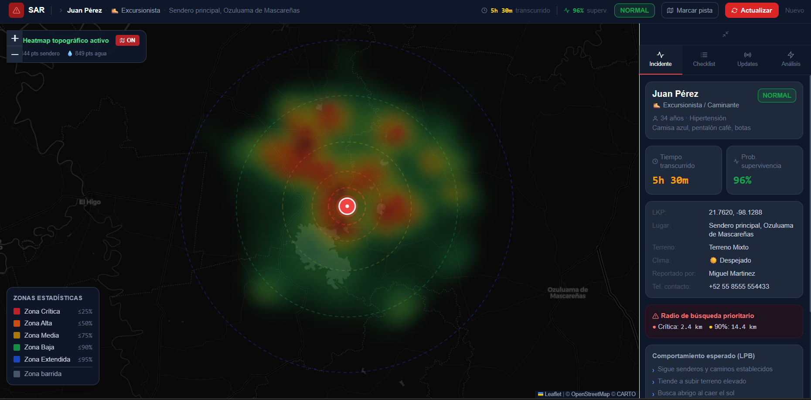
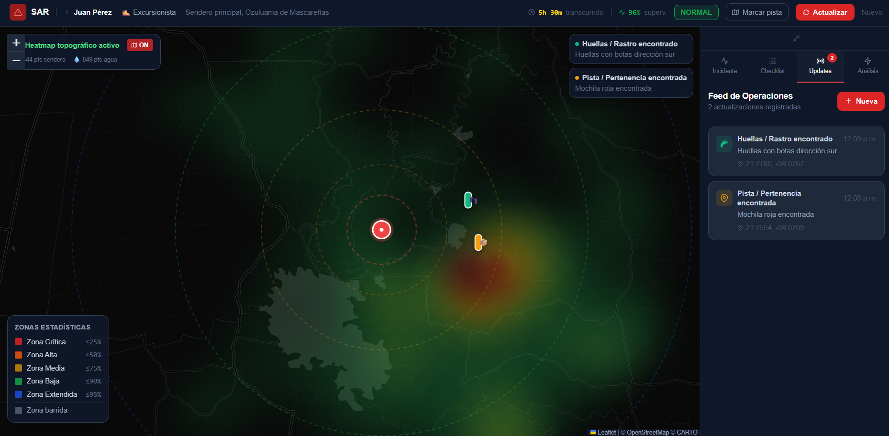
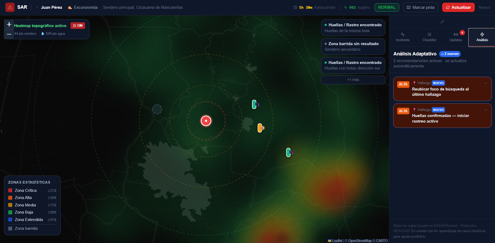

# SAR — Sistema de Búsqueda y Rescate Probabilístico

> Mapa de probabilidad en tiempo real para operaciones de búsqueda de personas perdidas en áreas naturales, basado en estadísticas de comportamiento de personas perdidas (Lost Person Behavior) y actualización bayesiana con evidencia de campo.



## El problema

En México, la mayoría de las búsquedas de personas perdidas en áreas naturales se coordinan con mapas impresos, WhatsApp y la intuición de los coordinadores. La pregunta crítica — **¿dónde buscamos primero?** — se responde sin datos, cuando existen décadas de estadísticas sobre cómo se comportan las personas perdidas según su perfil.

Este proyecto explora qué pasaría si esa evidencia estuviera en el mapa desde el primer minuto.

## Cómo funciona

### 1. Perfiles de comportamiento (LPB)

Al registrar un incidente se selecciona el perfil de la persona (excursionista, niño 1–6 años, adulto mayor, persona con demencia, cazador, alpinista, persona en crisis…). Cada perfil define:

- **Radios estadísticos de desplazamiento** (percentiles 25/50/75/90/95), basados en las estadísticas publicadas en *Lost Person Behavior* (Koester, 2008) y NASAR
- **Pesos de atracción topográfica**: los niños pequeños buscan agua, las personas con demencia viajan en línea recta, los alpinistas se mueven en vertical
- **Tendencias, factores de riesgo y checklist operativo** específicos del perfil

### 2. Prior topográfico automático

Al marcar el último punto conocido (LKP), el sistema descarga automáticamente la topografía real del área:

- **Overpass API (OpenStreetMap)** — senderos, ríos, cuerpos de agua, cumbres, manantiales
- **OpenTopoData (SRTM 90m)** — grilla de elevación

Con esos datos construye un *prior* de probabilidad: cada celda de la grilla se pondera según la atracción/repulsión del terreno para ese perfil (un excursionista gravita a senderos; un niño pequeño, al agua).

### 3. Actualización bayesiana con evidencia

Durante la operación, cada hallazgo actualiza el mapa:

| Evidencia | Efecto en el posterior |
|---|---|
| Pista / pertenencia | Likelihood gaussiana centrada en el hallazgo, σ crece con la antigüedad |
| Huellas | Igual, con mayor peso espacial |
| Contacto auditivo/visual | Máxima precisión, reubicación fuerte de la masa |
| 2+ pistas ubicadas | **Cono direccional**: infiere el vector de marcha y proyecta probabilidad hacia adelante |
| Zona barrida (con POD) | Reduce la masa en la zona proporcionalmente al POD reportado y la redistribuye al resto del área |



### 4. Motor de recomendaciones adaptativo

En paralelo, un motor de reglas evalúa continuamente el estado del incidente (tiempo transcurrido, clima, perfil, hallazgos, hora del día) y genera recomendaciones operativas priorizadas: protocolos de hipotermia, búsqueda silenciosa para niños pequeños, escalamiento de recursos a las 12/24/48 horas, referencia a protocolos mexicanos (Protocolo Alba, RNPDNO, coordinación con Protección Civil y CONANP).



## Stack

- **React 19** + Vite
- **Leaflet / react-leaflet** — mapa y capas
- Heatmap renderizado a canvas propio (sin librerías de heatmap)
- **Tailwind CSS**
- APIs públicas: Overpass (OSM), OpenTopoData (SRTM)
- Sin backend: todo el modelo corre en el cliente

## Correr localmente

```bash
npm install
npm run dev
```

## Aviso importante

⚠️ **Este es un proyecto de investigación y portafolio. NO está validado para uso operativo en búsquedas reales.** Las decisiones en operaciones SAR reales deben tomarlas coordinadores certificados con las herramientas y protocolos oficiales de su institución.

Las estadísticas de comportamiento provienen de datos publicados en: Koester, R. J. (2008). *Lost Person Behavior: A Search and Rescue Guide on Where to Look — for Land, Air and Water*. dbS Productions. Los datos ISRID subyacentes son propiedad de sus autores.

## Licencia

Todos los derechos reservados. El código está publicado con fines de portafolio y aprendizaje; contacta a la autora para cualquier otro uso.

---

*Desarrollado por Carolina Mota García.*
